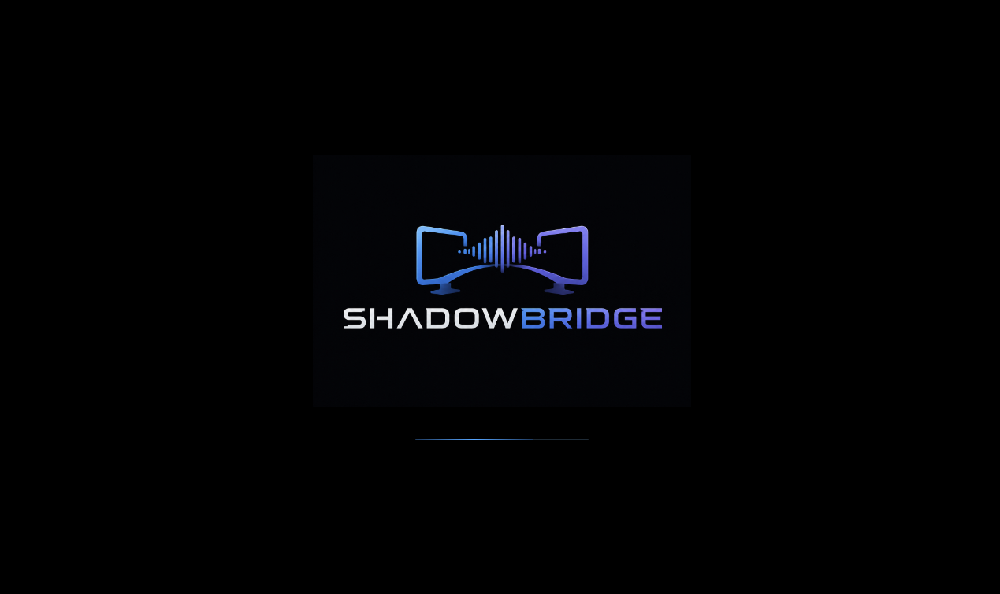
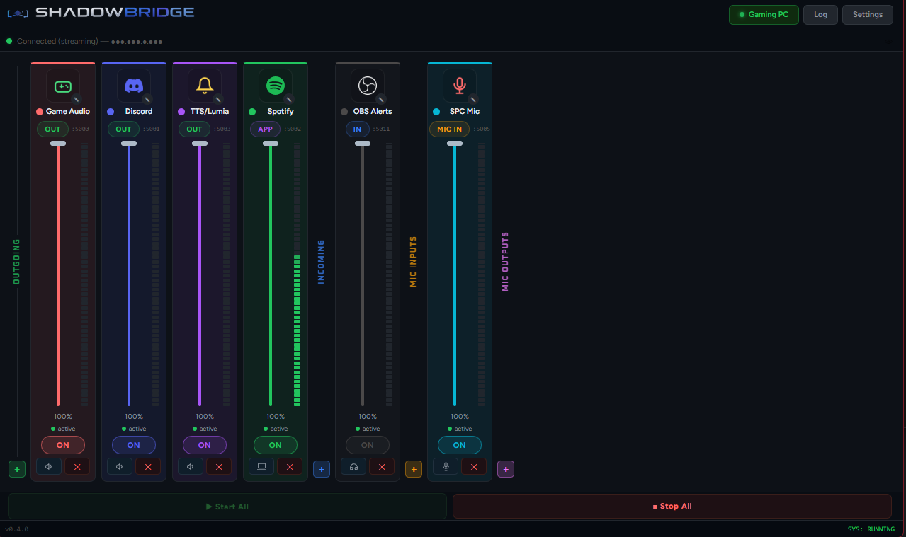
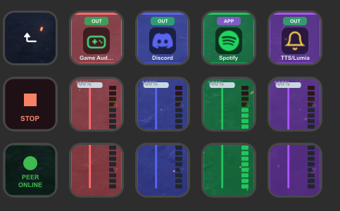
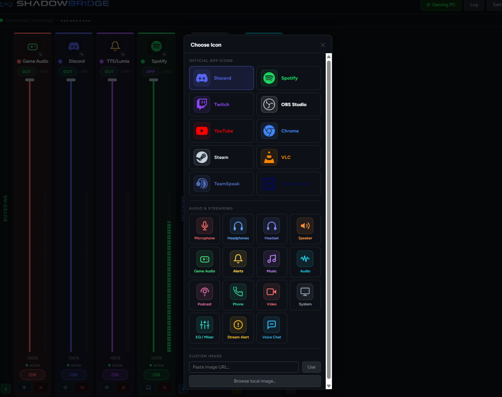
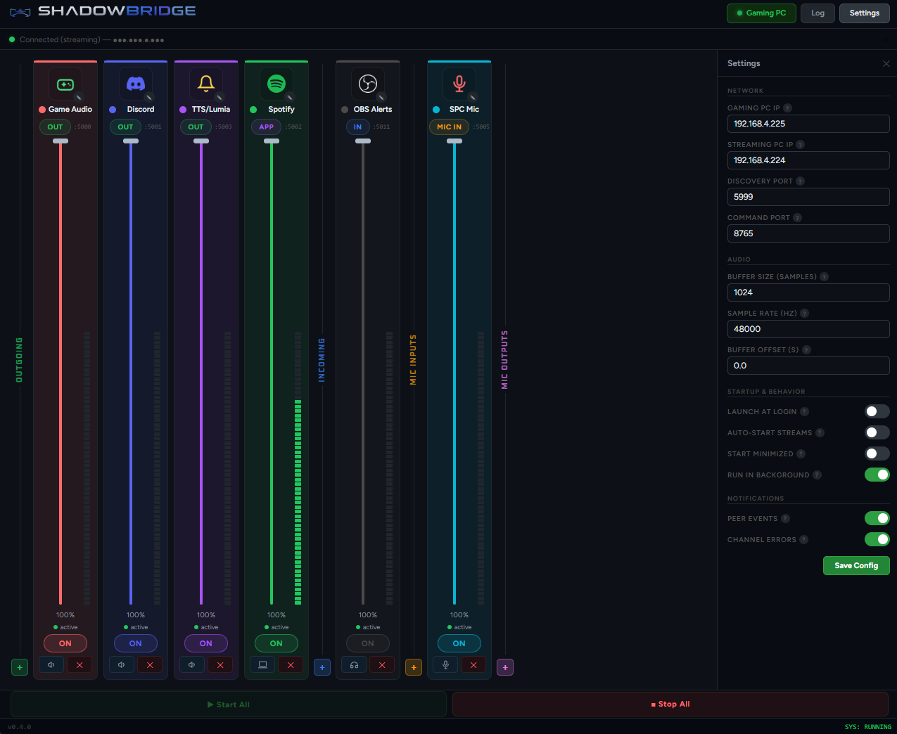

<div align="center">



**Audio routing software built by a streamer, for streamers.**

[](https://github.com/shadowsight00/ShadowBridge/releases)
[](https://github.com/shadowsight00/ShadowBridge/releases)
[](#license)
[](#stream-deck-plugin)

</div>

---

ShadowBridge is a Windows application for dual PC streaming setups. It routes audio from your gaming PC to your streaming PC over your local network — individually, per channel, with no complicated DAW software or hardware mixers. Game audio, Discord, Spotify, mic, alerts — each arrives at your streaming PC as a separate audio device that OBS can assign to its own recording track.

> **Upgrading from the old Python version?** The new installer detects it automatically and handles the migration. Your channel configuration is preserved.

---

## Screenshots



<table>
  <tr>
    <td></td>
    <td></td>
    <td></td>
  </tr>
  <tr>
    <td align="center"><em>Stream Deck plugin</em></td>
    <td align="center"><em>Icon picker</em></td>
    <td align="center"><em>Settings panel</em></td>
  </tr>
</table>

---

## What's New in v1.0.0

v1.0.0 is a complete ground-up rewrite in Rust and Svelte (Tauri). The audio engine, UI, networking, and Stream Deck plugin are all new.

### Highlights

- **Application audio capture** — capture a specific app's audio by process name, no virtual device needed
- **Hot-swap devices while streaming** — change audio devices or channel direction without stopping streams
- **Live monitoring before you start** — VU meters are active immediately on launch so you can check levels before going live
- **Synchronized Start/Stop** — pressing Start All on either PC triggers both simultaneously
- **Auto peer discovery** — both PCs find each other automatically, no IP setup required
- **Full channel customization** — per-channel color, icon, name, direction, and device — all persisted instantly
- **Rebuilt Stream Deck plugin** — live canvas-rendered channel strips with real-time VU meters, colors, and icons that sync from the app
- **System tray** — runs in the background while you stream
- **Native Windows installer** — proper Start Menu entry, uninstall support, and auto-migration from the old version

---

## Features

### Core Audio Engine

- **OUT** — WASAPI loopback capture of any render device (game audio, desktop audio, virtual audio devices)
- **IN** — UDP receive with jitter buffer, plays to any output device
- **APP** — captures a specific running application's audio by process name, no virtual routing needed
- **MIC** — WASAPI input device capture (microphone, headset, line in)
- **MICOUT** — receives mic audio from the peer and plays it to a local output
- Per-channel volume 0–100%, real-time, persisted on every change
- Mute with memory — restores pre-mute volume on unmute
- Hot-swap: restart one channel without touching any others
- Auto-reconnect: dropped channels reconnect automatically
- VU metering active on launch — monitor levels before starting streams

### VU Meters

- 14-segment RMS meter per channel
- Scale: –42 dBFS to 0 dBFS
- 100ms RMS window, 80ms update rate
- Silence detection — auto-reports "idle" after 150ms quiet
- Green → amber → red color progression

### Audio Settings

| Setting | Range | Default |
|---|---|---|
| Buffer Size | 64 – 8192 samples | 1024 |
| Sample Rate | 8000 – 192000 Hz | 48000 |
| Jitter Pre-roll | 0 – 5 seconds | 20ms |

---

### Network

- **Auto peer discovery** — UDP broadcast every 5 seconds, 15-second timeout, no IP config needed
- **Synchronized control** — Start All / Stop All on one PC triggers the other automatically
- **"Use Peer IP" button** — one click to apply the detected peer IP to your config
- **WebSocket API** — local server on `localhost:8765` for Stream Deck and external integrations

**Ports used:**

| Port | Purpose |
|---|---|
| 5000+ | Per-channel audio (UDP) |
| 5099 | Start/Stop sync between PCs (UDP) |
| 5999 | Peer discovery broadcast (UDP) |
| 8765 | WebSocket API (local only) |

All ports are configurable in Settings.

---

### UI & Channel Strips

- Horizontal scrolling mixer-style channel strips
- Four sections: **OUTGOING / INCOMING / MIC INPUTS / MIC OUTPUTS**
- Unlimited channels — add, remove, reorder by dragging within a section
- Per-channel:
  - **Color** — native OS color picker
  - **Icon** — Tabler icon library, official brand icons (Discord, Spotify, OBS, Twitch, and more), or upload your own image
  - **Name** — click the name to rename
  - **Direction** — click the badge to change type; channel moves to the correct section automatically
  - **Device** — dedicated picker per channel with refresh, red indicator if nothing is selected
  - **Volume fader** — drag vertically, tooltip shows percentage
  - **Mute** — toggle without changing volume
  - **Enable/disable** — per channel without stopping others
- Right-click context menu on any strip for quick access to all options
- Drag-and-drop reordering within sections, order persisted to config

---

### Customization & Settings

**Network**
- Gaming PC IP, Streaming PC IP
- Discovery port, Command port

**Audio**
- Buffer size, Sample rate, Jitter pre-roll offset

**Startup & Behavior**
- Launch at Windows login
- Auto-start streams when peer is detected
- Start minimized to tray
- Close to tray (run in background)

**Notifications** *(native Windows toasts)*
- Peer connected / disconnected
- Channel errors

---

### System Integration

- **System tray** — full context menu with streaming state, show/hide window, quit
- **Launch at login** — via Windows autostart registry
- **Single instance** — second launch brings the existing window to front
- **Log panel** — 200-line timestamped log, tagged by source: `[Engine]` `[Error]` `[Peer]` `[System]`
- **Config location** — `Documents\ShadowBridge\config.json`, written on every change

---

## Stream Deck Plugin

ShadowBridge includes a native Stream Deck plugin built with the official Elgato SDK v2.

### Actions

| Action | Description |
|---|---|
| **Toggle Streaming** | Start or stop all streams. Three states: START / LIVE / OFFLINE. Syncs with the peer PC. |
| **Toggle Channel** | Enable or disable one channel. Button renders a live mini channel strip — icon, name, color, and 14-segment VU meter matching the app exactly. |
| **Connection Status** | Shows peer connection state. Three states: SEARCHING / PEER ONLINE / APP OFFLINE. |
| **Channel Volume** | Stream Deck+ dial support. Rotate to adjust ±5% per tick, push to reset to 100%. Touch strip shows current level. |
| **Channel Strip** | Three-slot fader spanning two buttons. Slot 0 = channel header (press to toggle on/off). Slot 1 = upper fader (press to raise volume). Slot 2 = lower fader (press to lower or mute). The fader and VU meter render continuously across both buttons. |

### How it works

- Connects to `ws://localhost:8765` — auto-reconnects every 3 seconds
- All button artwork is rendered on canvas in real time
- Channel colors, icons, and names sync from the app instantly when changed
- Start/Stop sync propagates to the peer PC just like pressing the button in the app

---

## Requirements

- Windows 10 or Windows 11 (both PCs)
- Both PCs on the same local network
- Virtual audio devices on your streaming PC for audio separation:
  - **WaveLink** (recommended — works out of the box with Elgato hardware)
  - Voicemeeter or any other virtual audio software
- Stream Deck software v6.4 or later (optional — only needed for Stream Deck integration)

---

## Installation

### App

1. Download `ShadowBridge_Setup.exe` from the [Releases](https://github.com/shadowsight00/ShadowBridge/releases) page
2. Run the installer on **both** your gaming PC and your streaming PC
3. Launch ShadowBridge on both machines
4. The app detects which PC it's on from your network — switch manually with the mode button if needed
5. Configure your channels on each PC
6. Click **Start All** on either PC — both start simultaneously

> **Upgrading from the old Python version:** The installer handles it. Your existing channels and settings migrate automatically.

### Stream Deck Plugin

Download `com.shadowbridge.app.streamDeckPlugin` from the [Releases](https://github.com/shadowsight00/ShadowBridge/releases) page and double-click to install. ShadowBridge must be running for the plugin to connect.

---

## Setup Guide

### First Launch

ShadowBridge auto-detects your PC role from its network IP. Use the **Gaming PC / Streaming PC** button in the top bar to switch manually. Your channel config is stored per mode.

### Channel Sections

| Section | Direction | Purpose |
|---|---|---|
| **Outgoing** | OUT / APP | Audio leaving the gaming PC toward the streaming PC |
| **Incoming** | IN | Audio arriving at the streaming PC from the gaming PC |
| **Mic Inputs** | MIC | Microphone captured and sent to the streaming PC |
| **Mic Outputs** | MICOUT | Mic audio received from the peer, played locally |

### Adding a Channel

Click the **+** button in any section. Set the channel type, pick a device, give it a name and color. Everything saves as you go — no Save button needed.

### Using APP Capture

Set a channel's direction to **APP**. In the device picker, running applications with active audio sessions appear in the list. Select the one you want. ShadowBridge captures only that app's audio — no virtual routing device required.

### OBS Track Assignment

On your streaming PC, each incoming channel arrives as a separate virtual audio device. In OBS, add one Audio Capture source per channel and assign each to its own recording track. This keeps game audio, Discord, Spotify, and alerts completely separated for VOD editing and copyright management.

---

## WebSocket API

ShadowBridge exposes a local WebSocket server at `ws://localhost:8765` for external control.

### Commands (send to ShadowBridge)

```json
{ "cmd": "get_state" }
{ "cmd": "start_all" }
{ "cmd": "stop_all" }
{ "cmd": "toggle_channel", "id": "uuid" }
{ "cmd": "mute_channel", "id": "uuid" }
{ "cmd": "unmute_channel", "id": "uuid" }
{ "cmd": "set_volume", "id": "uuid", "value": 75 }
```

### Events (broadcast from ShadowBridge)

```json
{ "event": "state", "streaming": true, "peer_connected": true, "channels": [...] }
{ "event": "streaming_started" }
{ "event": "streaming_stopped" }
{ "event": "peer_connected", "ip": "192.168.x.x" }
{ "event": "peer_lost" }
{ "event": "channel_level", "id": "uuid", "level": 0.73 }
{ "event": "channel_status", "id": "uuid", "status": "active" }
{ "event": "channel_toggled", "id": "uuid", "enabled": false }
{ "event": "channel_appearance", "id": "uuid", "name": "...", "color": "#ff6b6b" }
```

---

## Building from Source

### Prerequisites

- [Rust](https://rustup.rs) (stable)
- [Node.js](https://nodejs.org) v20+
- [Tauri CLI](https://tauri.app) v2

### App

```bash
git clone https://github.com/shadowsight00/ShadowBridge.git
cd ShadowBridge
npm install
npm run tauri dev       # development
npm run tauri build     # production installer
```

### Stream Deck Plugin

```bash
cd streamdeck-plugin
npm install
npm run build
streamdeck link com.shadowbridge.app.sdPlugin
```

---

## Changelog

### v1.0.0 — Complete Rewrite (Tauri / Rust / Svelte)

This release replaces the Python/tkinter version entirely.

**New**
- Full rewrite in Rust (audio engine, networking) + Svelte (UI) using the Tauri framework
- APP capture mode — capture individual application audio by process name
- MICOUT channel direction — dedicated Mic Outputs section
- Hot-swap audio devices and channel direction while streaming
- VU meter monitoring active on launch before streaming starts
- Synchronized Start/Stop across both PCs via UDP control channel
- Auto peer discovery — no manual IP configuration required
- Per-channel color picker (native OS color wheel)
- Per-channel icon picker — Tabler icons, official brand icons, custom image upload
- Drag-and-drop channel reordering within sections
- Right-click context menu on channel strips
- Auto-suggestion of brand icons by application process name
- 7 configurable audio and network settings
- System tray with dynamic streaming state menu
- Launch at login via Windows autostart
- Native Windows toast notifications for peer and engine events
- 200-line timestamped log panel
- WebSocket API on localhost:8765 for external control
- Branded splash screen on launch
- Config auto-migration from AudioBridge and old ShadowBridge installs
- Branded NSIS + MSI installer (user-level, no admin required)
- Stream Deck plugin rebuilt on Elgato SDK v2 with 5 actions and live canvas rendering

**Changed**
- VU meters upgraded from single-bar peak to 14-segment RMS (–42dBFS to 0dBFS)
- Channel count increased from 5 fixed to unlimited dynamic
- Sections expanded from 2 (Outgoing/Return) to 4 (Outgoing/Incoming/Mic Inputs/Mic Outputs)
- Config location moved from `Documents\AudioBridge\` to `Documents\ShadowBridge\`

**Removed**
- Python/tkinter UI
- PyInstaller executable
- Fixed hardcoded channel list

---

### v0.4.0 — Final Python Release

Last release of the Python/tkinter version. Included per-channel color, MIC-IN/MIC-OUT channel types, and Stream Deck integration.

---

## License

ShadowBridge is free for personal and streaming use.

© 2025 shadowsight00. All rights reserved. Redistribution, resale, or repackaging without permission is prohibited.
